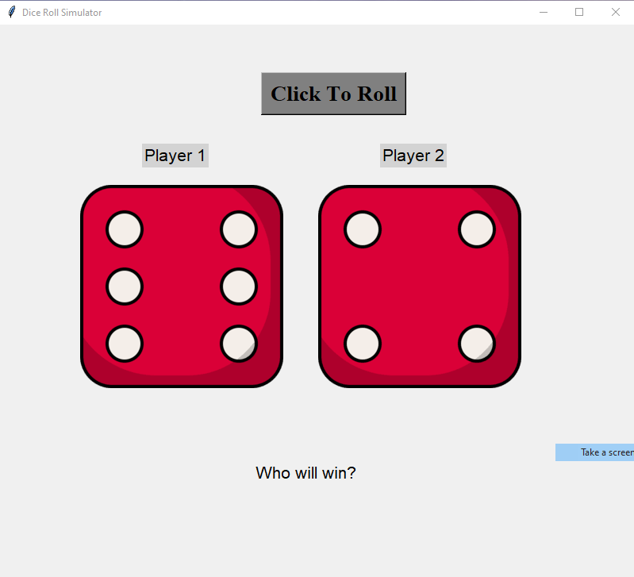
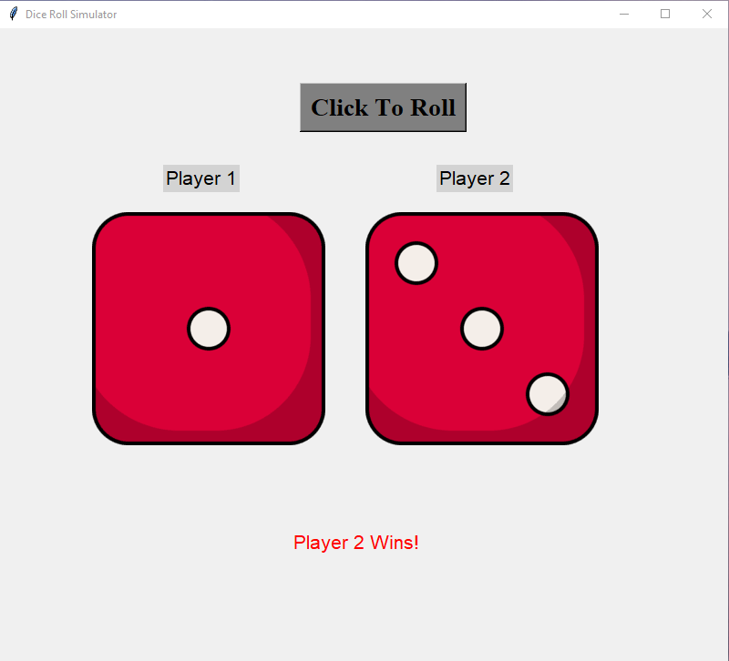

# Dice Roll Simulator 🎲

**Dice Roll Simulator** is an interactive Python-based GUI application that lets two players roll dice, displays the result with dynamic images, and announces the winner. It's a fun way to visualize dice rolls and practice GUI development in Python.

---

## 🎯 Features

- **User-Friendly GUI**: Built using `Tkinter`, the interface is simple and intuitive.
- **Dynamic Dice Images**: Dice images update based on the random rolls for both players.
- **Winner Announcement**: Clearly displays the winner (Player 1, Player 2, or a tie) after each roll.
- **Interactive Button**: A single button triggers the dice roll and updates the UI.
- **Realistic Visuals**: Includes dice images for a more immersive experience.

---

## 📸 Screenshots

### Initial Screen
*What you see when the application starts.*  


### Rolling the Dice
*After clicking the "Roll" button.*  


---

## 🛠️ Technologies Used

- **Python 3.x**: The core programming language for this application.
- **Tkinter**: Used for creating the graphical user interface.
- **Pillow (PIL)**: Handles loading and displaying dice images dynamically.
- **Random Library**: Simulates the dice rolls by generating random numbers.

---


### 🎲 Dice Images

Ensure the `images` directory contains six images named:
- `dice1.png`  
- `dice2.png`  
- `dice3.png`  
- `dice4.png`  
- `dice5.png`  
- `dice6.png`  

Each image should visually represent one side of a six-sided dice.

---

## 🔧 Setup and Installation

### Prerequisites
1. Python 3.x installed on your system. [Download Python](https://www.python.org/downloads/)
2. Install the `Pillow` library (if not already installed):
   ```bash
   pip install pillow
   ```

### Installation
1. Clone the repository or download the ZIP file:
   ```bash
      git clone https://github.com/your-username/Dice-Roll-Simulator.git
      cd Dice-Roll-Simulator
   ```
2. Ensure the project structure matches the one described above, with dice images in the images directory.

3. Run the Python script:
   ```bash
     python main.py
   ```

4. Interact with the GUI:
   - Click the "Click To Roll" button to roll the dice.
   - View the dice images and result announcement.
